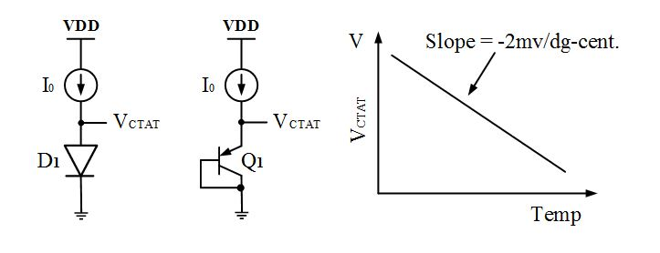
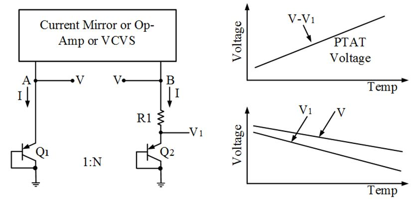

## BangdGap Reference VSD

A BGR circuit is a voltage and temperature independent voltage reference circuit that is used in integrated circuits widely for generating refernce voltages for circuits like ADC, DAC, LDO etc.

 In such systens typically temperature coeffience needed is 10-50ppm/deg C  0r ~10uV-50uV/deg C for vref=1V and power supply rejection, about 40-60 dB or 1-10mV/V
different basic strustures can be used to create Voltage reference like Resistor divider or  Forward bias p-n junction but they all show huge variation with temperature and supplu voltage.
###      Operating Principle
Voltage across BJT has negative temp coefficient while theraml voltage(Vt) has positive temp coefficient. If these two are added in a certain proportion, positive and negative temp coefficient cancel each other and temp independent Vreg is obtained which is ~1.2V (bandgap energy of silicon at 0 K)

###  BGR Compenents.
  CTAT voltage genration circuit  
  PTAT voltage generation circuit  
  Self Biased Curr Mirror  
  reference branch circuit  
  Start up circuit  
  

  
  
  
 ### 1. CTAT
  Diode connected PNP, Emitter voltage here shows CTAT behaviour with temperature
CTAT slope increases with increasing number of devices or increasing current.

 

###   2. PTAT
 
BJT curr equation.  
I= Is e(V/Vt)  

Gives us,  
V= Vt in(I/Is)    

For branch A, V = Vt ln(I/Is)  and for branch B, V1= Vt ln(1/NIs)  
V-V1 = Vtln(N)    
As discussed before Vt is PTAT    
dVt /dt = 85uV/deg C    

Here, V1= voltage across the BJT is CTAT    
V= Voltage cross R and Q2 is also CTAT but with lesser slope
hence we get V-V1 = voltage cross R1= PTAT

I.R1 = V=V1  = Vt Ln(N)
hence R= Vt ln(N)/I

Reference Branch Circuit

/image

